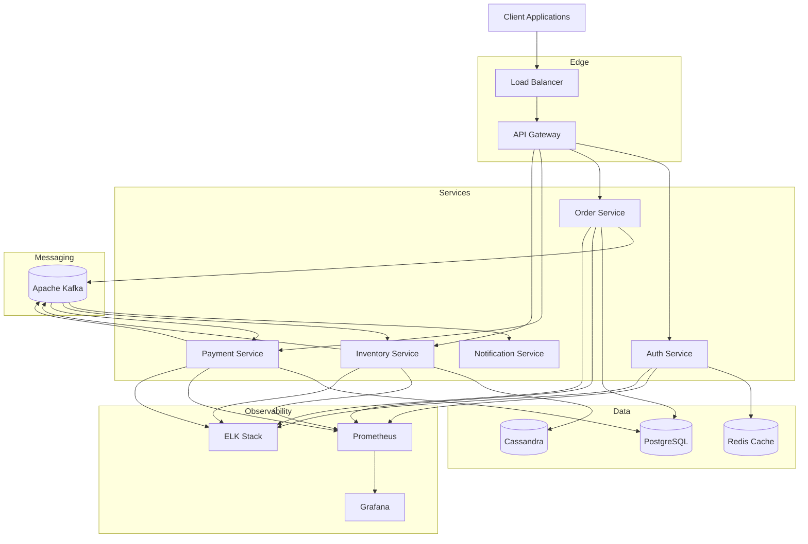
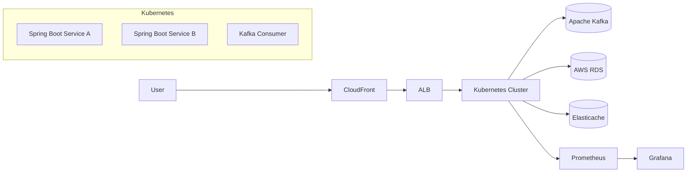

<h1 align="center">Hi 👋, I'm Jeshwin William James</h1>

<h3 align="center">
Backend Engineer | Distributed Systems | Kafka | Spring Boot | AWS | Kubernetes
</h3>

  

---

# 💫 About Me

Software Engineer with 3+ years of experience building scalable distributed systems, event-driven microservices, and cloud-native backend applications.

Specialized in:

- Java
- Spring Boot
- Kafka
- Distributed Systems
- AWS & Kubernetes
- High-Throughput Backend Systems

Currently focused on low-latency services, event-driven architectures, and scalable microservices deployed on cloud-native infrastructure.

---

# 🚀 What I Do

- Build distributed event-driven systems
- Design scalable microservices architectures
- Develop high-throughput backend services
- Optimize performance & reduce latency
- Deploy cloud-native applications
- Work with Kafka-based async processing

---

# 🧠 Areas of Interest

- Distributed Systems
- System Design
- Event-Driven Architecture
- Microservices Architecture
- High-Throughput Backend Services
- Cloud-Native Applications
- Performance Optimization

---

# ⚡ Technologies

---

# 🏗 Distributed Event Processing Architecture

---

# ☁️ Cloud-Native Deployment Architecture

---

# 💼 Experience

## Software Engineer — State Street

- Built low-latency Spring Boot microservices for financial transaction processing
- Designed Kafka-based event-driven reconciliation pipelines
- Optimized database queries improving throughput
- Deployed containerized services using Docker & Kubernetes

---

## Software Engineer — Accenture (Client: Flipkart)

- Developed high-traffic checkout microservices used by millions
- Implemented Kafka-based asynchronous processing pipelines
- Improved payment success rate and reduced API latency
- Built scalable cloud-native microservices architecture

---

# 🚀 Featured Projects

## Distributed Event Processing System

Scalable microservices backend system using Kafka and Spring Boot for real-time event processing.

### Tech Stack

Java • Spring Boot • Kafka • PostgreSQL • Docker

---

## Mobile Payment Security System

Device authentication framework using IMEI verification for secure mobile payments.

### Tech Stack

Java • Spring Boot • REST APIs • MySQL

---

# 📊 GitHub Stats

  

  

  

---

# 🎓 Education

## MS in Computer Science
Oklahoma City University

## B.Tech in Computer Science
Hindustan Institute of Technology & Science

---

# 🏆 Certifications

- AWS Certified Solutions Architect – Associate

---

# 📫 Connect With Me

---

⚡ Focused on building scalable infrastructure, distributed systems, and production-grade backend services.

