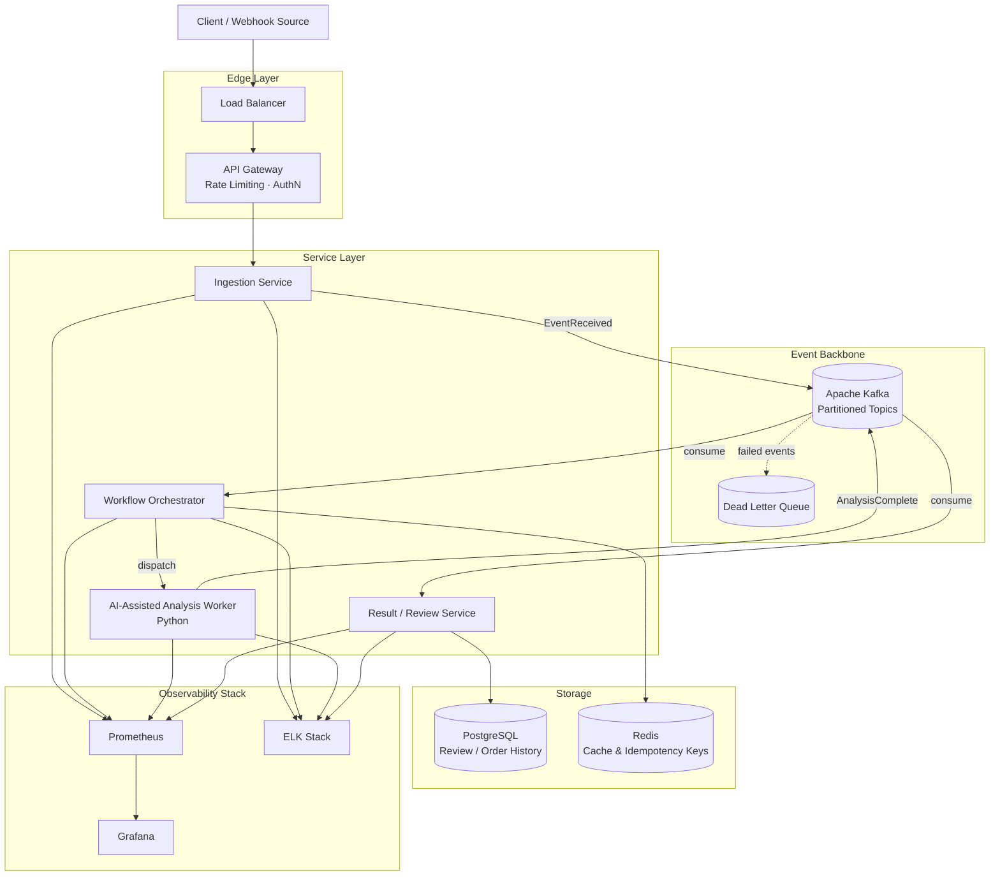
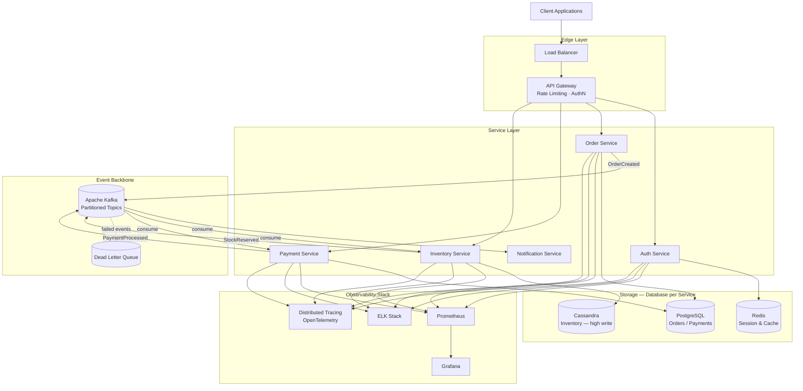
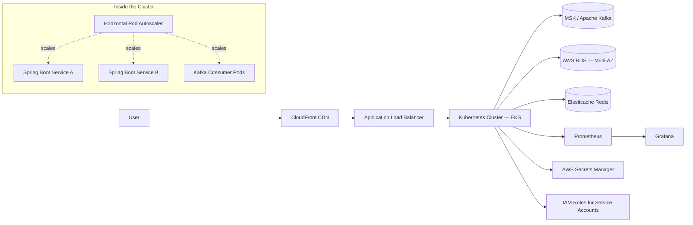

  

  

  
  
  
  

---

## 💫 About Me

Software Engineer with **4+ years** of experience across **distributed systems, AI-enabled platforms, backend services, and cloud infrastructure**, working primarily with **Java, Python, Kafka, and AWS**.

- 🧠 Building backend platforms where **AI-assisted tooling meets production-grade reliability** — not just prompt wrappers, but event-driven services with retries, observability, and failure recovery
- 🏗️ Deep focus on **Kafka-based orchestration**, idempotent processing, sagas, and dead-letter isolation at scale
- 📄 Peer-reviewed **Springer publication** (ICSADL 2022) on mobile payment security
- ☁️ **AWS Certified Solutions Architect – Associate**
- 💬 Ask me about event-driven architecture, AI-assisted review pipelines, or reconciliation systems at scale

---

## ⚡ Core Skills

**Backend Engineering** — Java · Spring Boot · REST APIs · gRPC · Spring Security · Hibernate · JPA · service design

**Distributed Systems** — Kafka · JMS · asynchronous workflows · retry strategies · dead-letter queues · resiliency patterns

**AI Platforms** — Python · workflow orchestration · AI-assisted review systems · platform integration · evaluation-minded tooling

**Cloud, Data & Operations** — AWS · GCP · Docker · Kubernetes · PostgreSQL · Oracle · Redis · Prometheus · Grafana · ELK · CI/CD

---

## 🏗 System Architecture — AI-Assisted Event-Driven Platform

A generalized architecture reflecting the shape of the systems I build: async event backbone feeding both traditional services and an AI-assisted processing layer, with observability wired through everything.

**Design decisions worth calling out:**

| Concern | Approach | Why |
|---|---|---|
| Service coupling | Kafka as async backbone instead of sync REST chains | Decouples producers/consumers, absorbs bursty webhook/traffic spikes, enables replay |
| AI worker isolation | Dedicated AI-assisted worker pool, decoupled from ingestion | AI latency variance never blocks core ingestion path |
| Failure handling | Dead-letter queues + retry topics + idempotency keys | Poison messages don't block partitions; safe to retry without duplicate side-effects |
| Consistency | Eventual consistency via event choreography, sagas for multi-step transactions | Avoids distributed locks; each service stays autonomous |
| Observability | Metrics (Prometheus), logs (ELK), per-service dashboards | Root-causing latency across service and AI-worker boundaries |

---

## 🏗 System Architecture — Distributed Event Processing Platform

A deeper reference architecture reflecting the backend platforms I build day-to-day: request path, async event backbone, storage-per-service, and full observability.

**Design decisions worth calling out:**

| Concern | Approach | Why |
|---|---|---|
| Service coupling | Kafka as async backbone instead of sync REST chains | Decouples producers/consumers, absorbs traffic spikes, enables replay |
| Data ownership | Database-per-service (PostgreSQL, Cassandra, Redis) | Avoids shared-schema coupling; each store matches its access pattern |
| Failure handling | Dead-letter queues + retry topics | Poison messages don't block partition consumers |
| Consistency | Eventual consistency via event choreography, sagas for multi-step transactions | Avoids distributed locks; each service stays autonomous |
| Observability | Metrics (Prometheus), logs (ELK), traces (OTel) per service | Root-causing latency across service boundaries |

---

## ☁️ Cloud-Native Deployment Architecture

How the platforms above get deployed and scaled in production.

**Infra notes:** GitOps-style deploys, HPA driven by custom Kafka-consumer-lag metrics rather than just CPU, and IRSA (IAM Roles for Service Accounts) for least-privilege pod-level AWS access.

---

## 💼 Experience

**Software Engineer — State Street** *(Jan 2026 – Present)*
Built low-latency fund transaction and reconciliation services using Java, Spring Boot, Kafka, JMS, Oracle, PostgreSQL, Docker, Kubernetes, Jenkins, and AWS.
- Improved platform throughput by **40%** through event-driven transaction pipelines
- Reduced database query latency from **3.2s to under 1.1s** in production
- Enabled operations teams to resolve breaks **35% faster** with workflow dashboards

**Software Engineer — Accenture** *(Client: Flipkart, Feb 2022 – Dec 2024)*
Delivered backend systems for large-scale checkout and payment flows using Java, Spring Boot, Kafka, Cassandra, MySQL, Redis, Elasticsearch, Docker, Kubernetes, Jenkins, and GCP.
- Improved payment success rate by **12%** with smart-retry payment orchestration
- Reduced end-to-end API latency by **35%** through performance tuning
- Cut infrastructure overhead by **22%** via scaling and cloud optimization

---

## 🚀 Featured Builds

### [PR Intelligence Platform](https://github.com/jeshwinwilliam/pr-intelligence-platform-jeshwin)
AI-assisted pull request analysis platform with event-driven review orchestration, persistent review history, and observability-first service design.
`Spring Boot` `Kafka` `AI-assisted review` `Docker`
📐 [System design write-up](https://jeshwin.com/system-design/pr-intelligence/index.html)

### [Distributed Order Processing Platform](https://github.com/jeshwinwilliam/distributed-event-processing-system)
Order, payment, inventory, and logistics workflow architecture with Kafka-driven orchestration, idempotent processing, and resilient failure recovery across service boundaries.
`Java` `Spring Boot` `Kafka` `PostgreSQL` `Saga pattern`
📐 [System design write-up](https://jeshwin.com/system-design/order-processing/index.html)

### [Mobile Payment Security System](https://github.com/jeshwinwilliam/mobile-payment-security-system)
IMEI-driven device verification system for mobile payment authentication and fraud-aware decision flows — connected to a peer-reviewed publication.
`Java` `Spring Boot` `REST APIs` `Security`
📐 [System design write-up](https://jeshwin.com/system-design/mobile-payment-security/index.html)

### Real-Time Transaction Reconciliation System
Trade ingestion, validation, ledger updates, duplicate detection, and reconciliation workflows for high-integrity financial operations.
`Kafka` `Partitioned processing` `Auditability`
📐 [System design write-up](https://jeshwin.com/system-design/reconciliation/index.html) *(case study generalized from production work)*

---

## 📄 Publication

**"Improved Security on Mobile Payments Using IMEI Verification"**
Peer-reviewed conference paper, ICSADL 2022 — published in Springer's *Advances in Intelligent Systems and Computing* (Sentiment Analysis and Deep Learning, 2023, pp. 183–193).
[View on Springer](https://link.springer.com/chapter/10.1007/978-981-19-5443-6_16) · [DOI](https://doi.org/10.1007/978-981-19-5443-6_16) · 1120 accesses · 1 citation

---

## 📊 GitHub Stats

  

  

  

## 📈 Activity Graph

  

## 🐍 Contribution Snake

  

---

## 🎓 Education & Credentials

**MS in Computer Science** — Oklahoma City University *(2026)*
**B.Tech in Computer Science and Engineering** — Hindustan University *(2022)*
**AWS Certified Solutions Architect – Associate** — issued March 2026

---

## 📫 Contact

Open to software engineering roles across **backend, distributed systems, and AI platforms** — especially event-driven architecture, cloud infrastructure, and developer-facing systems where reliability, scale, and product thinking matter.

  
  
  
  

⚡ Systems, scale, signal — building AI-enabled platforms and resilient backend infrastructure for production environments.

<!--
SETUP: two GitHub Actions power the animated sections above.
Add both workflow files to .github/workflows/ in your `jeshwinwilliam/jeshwinwilliam` repo.

1) Contribution Snake — .github/workflows/snake.yml
---------------------------------------------------------------
name: Generate Snake
on:
  schedule:
    - cron: '0 0 * * *'
  workflow_dispatch:
  push:
    branches: [ main ]
jobs:
  generate:
    runs-on: ubuntu-latest
    steps:
      - uses: Platane/snk@v3
        id: snake-gif
        with:
          github_user_name: jeshwinwilliam
          outputs: |
            dist/github-contribution-grid-snake.svg
            dist/github-contribution-grid-snake-dark.svg?palette=github-dark
      - uses: crazy-max/ghaction-github-pages@v3
        with:
          target_branch: output
          build_dir: dist
        env:
          GITHUB_TOKEN: ${{ secrets.GITHUB_TOKEN }}
-->
