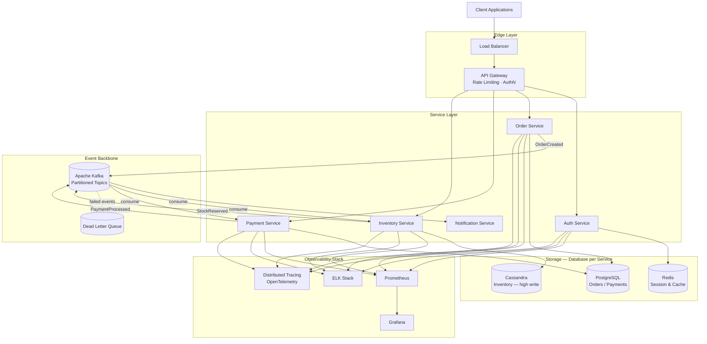
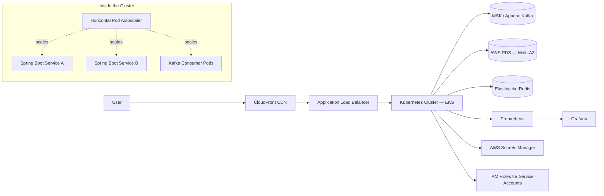

  

  

  
  
  

---

## 💫 About Me

Software Engineer with 3+ years of experience building **scalable distributed systems**, **event-driven microservices**, and **cloud-native backend applications**.

- 🔭 Currently building low-latency, event-driven services on cloud-native infrastructure
- 🌱 Deepening expertise in distributed consensus, CQRS, and streaming architectures
- 💬 Ask me about Kafka internals, Spring Boot performance tuning, or Kubernetes scaling
- ⚡ Fun fact: I think in sequence diagrams

---

## ⚡ Tech Stack

---

## 🏗 System Architecture — Distributed Event Processing Platform

A reference architecture reflecting the kind of systems I design and build: request path, async event backbone, storage-per-service, and full observability.

**Design decisions worth calling out:**

| Concern | Approach | Why |
|---|---|---|
| Service coupling | Kafka as async backbone instead of sync REST chains | Decouples producers/consumers, absorbs traffic spikes, enables replay |
| Data ownership | Database-per-service (PG, Cassandra, Redis) | Avoids shared-schema coupling; each store matches its access pattern |
| Failure handling | Dead-letter queues + retry topics | Poison messages don't block partition consumers |
| Consistency | Eventual consistency via event choreography, sagas for multi-step transactions | Avoids distributed locks; each service stays autonomous |
| Observability | Metrics (Prometheus), logs (ELK), traces (OTel) per service | Root-causing latency across service boundaries |

---

## ☁️ Cloud-Native Deployment Architecture

**Infra notes:** GitOps-style deploys, HPA driven by custom Kafka-consumer-lag metrics rather than just CPU, and IRSA for least-privilege pod-level AWS access.

---

## 💼 Experience

**Software Engineer — State Street**
- Built low-latency Spring Boot microservices for financial transaction processing
- Designed Kafka-based event-driven reconciliation pipelines
- Optimized database queries, improving throughput
- Deployed containerized services using Docker & Kubernetes

**Software Engineer — Accenture** *(Client: Flipkart)*
- Developed high-traffic checkout microservices used by millions
- Implemented Kafka-based asynchronous processing pipelines
- Improved payment success rate and reduced API latency
- Built scalable cloud-native microservices architecture

---

## 🚀 Featured Projects

### Distributed Event Processing System
Scalable microservices backend using Kafka and Spring Boot for real-time event processing.
`Java` `Spring Boot` `Kafka` `PostgreSQL` `Docker`

### Mobile Payment Security System
Device authentication framework using IMEI verification for secure mobile payments.
`Java` `Spring Boot` `REST APIs` `MySQL`

---

## 📊 GitHub Stats

  

  

  

## 📈 Activity Graph

  

## 🕒 Recent GitHub Activity

<!--START_SECTION:activity-->
<!-- This section auto-updates via the jamesgeorge007/github-activity-readme action — see setup note below -->
<!--END_SECTION:activity-->

## 🐍 Contribution Snake

  

<!-- Generated nightly by the Platane/snk GitHub Action — snake "eats" your contribution graph. See setup note below. -->

---

## 🎓 Education

**MS in Computer Science** — Oklahoma City University
**B.Tech in Computer Science** — Hindustan Institute of Technology & Science

## 🏆 Certifications

- AWS Certified Solutions Architect – Associate

---

⚡ Focused on building scalable infrastructure, distributed systems, and production-grade backend services.

<!--
SETUP: two GitHub Actions power the animated sections above.
Add both workflow files to .github/workflows/ in your `jeshwinwilliam/jeshwinwilliam` repo.

1) Recent Activity list — .github/workflows/update-readme.yml
---------------------------------------------------------------
name: Update README Activity
on:
  schedule:
    - cron: '0 */6 * * *'
  workflow_dispatch:
jobs:
  update-readme:
    runs-on: ubuntu-latest
    steps:
      - uses: jamesgeorge007/github-activity-readme@master
        env:
          GH_TOKEN: ${{ secrets.GITHUB_TOKEN }}

2) Contribution Snake — .github/workflows/snake.yml
---------------------------------------------------------------
name: Generate Snake
on:
  schedule:
    - cron: '0 0 * * *'
  workflow_dispatch:
  push:
    branches: [ main ]
jobs:
  generate:
    runs-on: ubuntu-latest
    steps:
      - uses: Platane/snk@v3
        id: snake-gif
        with:
          github_user_name: jeshwinwilliam
          outputs: |
            dist/github-contribution-grid-snake.svg
            dist/github-contribution-grid-snake-dark.svg?palette=github-dark
      - uses: crazy-max/ghaction-github-pages@v3
        with:
          target_branch: output
          build_dir: dist
        env:
          GITHUB_TOKEN: ${{ secrets.GITHUB_TOKEN }}
-->

