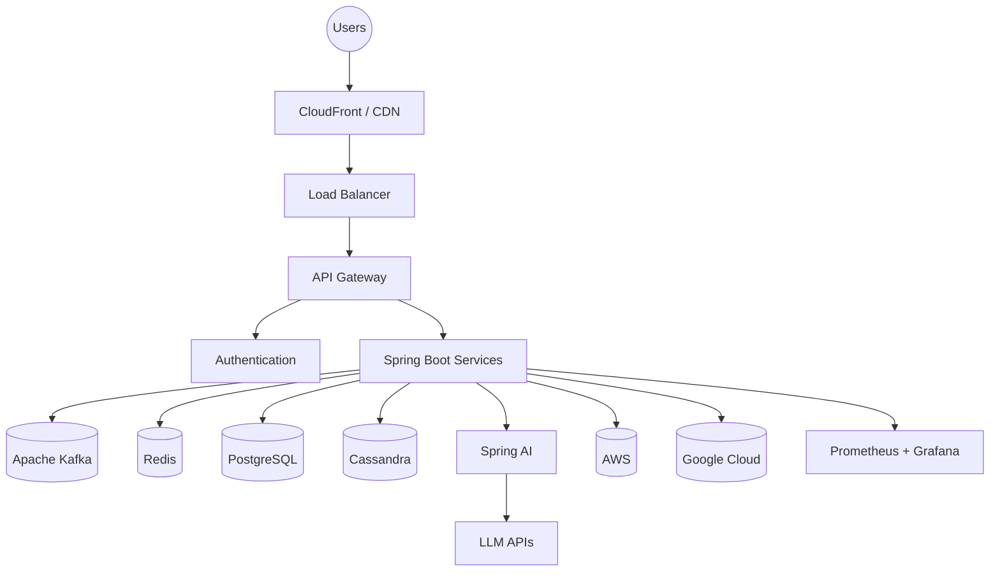
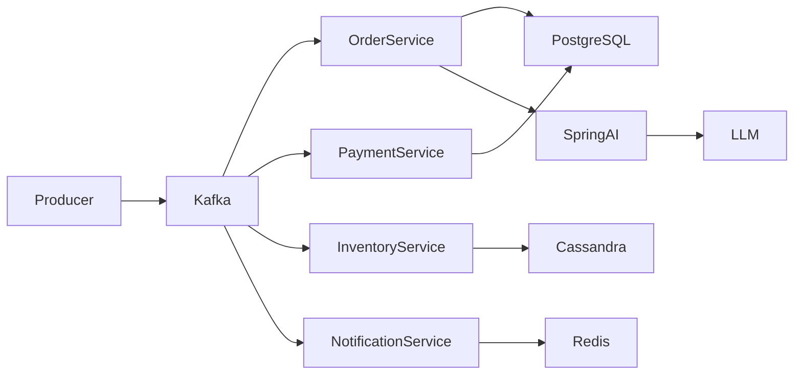
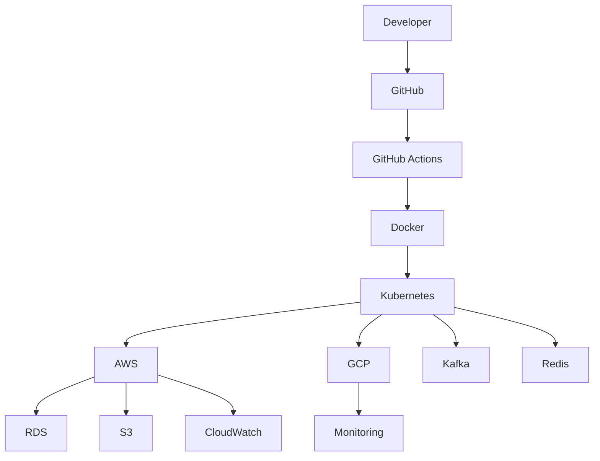
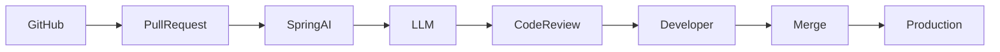

<div align="center">


</div>

<h1 align="center">
Hi 👋 I'm Jeshwin William James
</h1>

<h3 align="center">

Software Engineer

</h3>

<p align="center">


</p>

---

<p align="center">

<a href="https://jeshwin.com">

</a>

<a href="https://linkedin.com/in/jeshwin-william-james-33a83b1a9">

</a>

<a href="mailto:jeshwin.w.james@gmail.com">

</a>

<a href="https://github.com/jeshwinwilliam">

</a>

</p>

---

# 🚀 About Me

```diff
+ Software Engineer with 3+ years of experience

+ Building scalable software

+ Distributed Systems

+ Cloud-Native Applications

+ AI-Powered Systems

+ Backend Engineering

+ Performance Engineering
---

# ⚡ Tech Stack

<div align="center">

### 👨‍💻 Languages

<p>


</p>

---

### 🚀 Backend & Frameworks

<p>


</p>

---

### ☁️ Cloud & DevOps

<p>


</p>

---

### 🗄 Databases & Messaging

<p>


</p>

---

### 🤖 AI Engineering

<p>


</p>

</div>

---

# 📊 GitHub Analytics

<div align="center">


</div>

---

<div align="center">


</div>

---

<div align="center">


</div>

---

<div align="center">


</div>

---

# 📈 Engineering Focus

<table>

<tr>

<td width="50%">

## Backend Engineering

- Java
- Spring Boot
- REST APIs
- gRPC
- Microservices
- Event-Driven Systems

</td>

<td width="50%">

## Cloud & Infrastructure

- AWS
- Google Cloud
- Docker
- Kubernetes
- CI/CD
- High Availability

</td>

</tr>

<tr>

<td width="50%">

## AI Systems

- Spring AI
- LLM APIs
- Prompt Engineering
- AI Workflows
- Developer Platforms

</td>

<td width="50%">

## Distributed Systems

- Kafka
- Distributed Messaging
- Scalability
- Fault Tolerance
- Low Latency
- System Design

</td>

</tr>

</table>

---
---

# 🏗 Engineering Architecture

## 🌐 Modern Software Engineering Stack



---

# ⚡ Event-Driven Architecture



---

# ☁️ Cloud Native Infrastructure



---

# 🤖 AI-Powered Engineering Workflow



---

# 💡 Engineering Philosophy

<div align="center">

| Principle | Focus |
|------------|------------------------------|
| 🚀 Performance | Low-Latency Systems |
| 🔄 Scalability | Distributed Architectures |
| ☁️ Cloud | Cloud-Native Applications |
| 🤖 AI | Intelligent Software Systems |
| ⚡ Reliability | Fault-Tolerant Systems |
| 🏗 Design | Clean Architecture |

</div>

---
---

# 🚀 Featured Engineering Projects

<div align="center">

<table>

<tr>

<td width="50%">

<h3 align="center">

🤖 AI-Powered Pull Request Intelligence Platform

</h3>

<p align="center">

Enterprise-grade AI platform that automates pull request reviews using
Spring AI, Apache Kafka, Java, PostgreSQL and distributed microservices.

</p>

<p align="center">


</p>

### ✨ Highlights

- AI-assisted code review
- Kafka event processing
- Distributed microservices
- Spring AI integration
- PostgreSQL persistence
- Docker deployment

### 📈 Results

✔ 65% faster review turnaround

✔ 10,000+ PR events/day

✔ Fault-tolerant event processing

<p align="center">

<a href="https://github.com/jeshwinwilliam/pr-intelligence-platform-jeshwin">


</a>

</p>

</td>

<td width="50%">

<h3 align="center">

⚡ Distributed Event Processing System

</h3>

<p align="center">

Real-time event-driven platform built using Spring Boot, Apache Kafka and Docker.

</p>

<p align="center">


</p>

### ✨ Highlights

- Kafka Consumer Groups
- Dead Letter Queues
- Retry Mechanisms
- REST APIs
- Dockerized Services
- Horizontal Scaling

### 📈 Results

✔ 50,000+ events/day

✔ Low-latency processing

✔ High availability

<p align="center">

<a href="https://github.com/jeshwinwilliam/distributed-event-processing-system">


</a>

</p>

</td>

</tr>

</table>

</div>

---

# 🌟 Additional Projects

| Project | Description | Stack |
|---------|-------------|------|
| 🌍 Distributed Order Processing Platform | Event-driven commerce platform | Java • Kafka • Spring Boot |
| 🏦 VaultMesh Banking Platform | Banking microservices platform | Java • Spring Boot • PostgreSQL |
| 🔐 GlobalLock | Distributed locking service | Java • Redis • Spring |
| 💳 Mobile Payment Security System | Springer Publication Project | Java • MySQL |
| 🤖 AI Developer Tools | AI-powered backend utilities | Spring AI • Java • Python |

---

# 📈 Engineering Highlights

<div align="center">

| Focus | Experience |
|-------|------------|
| ⚡ Backend Engineering | 3+ Years |
| 🌐 Distributed Systems | Production Experience |
| ☁️ Cloud Platforms | AWS • GCP |
| 🤖 AI Systems | Spring AI • LLM APIs |
| 🚀 Event Streaming | Apache Kafka |
| 🏗 System Design | Scalable Architectures |

</div>

---

# 🏆 Selected Achievements

- 🚀 Designed and built distributed event-driven systems.
- ⚡ Reduced API latency by **35%** through performance optimization.
- 📈 Improved transaction throughput by **40%**.
- 💳 Increased payment success rate by **12%**.
- ☁️ Reduced infrastructure cost by **22%**.
- 🤖 Built AI-powered developer platforms with Spring AI.
- 🏗 Designed production-grade cloud-native applications.

---
---

# 📚 Research & Publications

<div align="center">

## 🏆 Springer Publication

### Improved Security on Mobile Payments Using IMEI Verification

Published in **Springer – Advances in Intelligent Systems and Computing**

Secure mobile payment authentication framework designed to improve fraud detection and device verification.

<p>

<a href="YOUR_PUBLICATION_LINK">


</a>

</p>

</div>

---

# ✍ Technical Writing

<div align="center">

| Latest Articles | Status |
|-----------------|--------|
| Designing Reliable Distributed Systems | 🚧 Coming Soon |
| Spring AI for Backend Engineers | 🚧 Coming Soon |
| Event-Driven Architectures using Kafka | 🚧 Coming Soon |
| Building Scalable Cloud Native Applications | 🚧 Coming Soon |
| Performance Optimization in Spring Boot | 🚧 Coming Soon |

</div>

---

# 🌍 Open Source Philosophy

> I enjoy building production-quality software that helps developers understand scalable systems,
distributed architectures and modern backend engineering.

Current areas of focus

- Distributed Systems
- Cloud Infrastructure
- AI Systems
- Backend Engineering
- Open Source
- System Design

---

# 🌐 Portfolio

<div align="center">

<a href="https://jeshwin.com">


</a>

</div>

---

# 💼 Professional Journey

```text

2022
│
├── Accenture
│     Backend Engineering
│
2025
│
├── MS Computer Science
│
2026
│
├── State Street
│     Financial Distributed Systems
│
├── AWS Certified Solutions Architect
│
└── AI Engineering Projects

```

---

# 🎯 Current Focus

```diff

+ Building AI-powered software

+ Distributed Systems

+ Cloud Infrastructure

+ Event-Driven Architecture

+ System Design

+ Open Source

+ Developer Platforms

```

---

# 🌟 Fun Engineering Facts

```yaml

Current Role:
  Software Engineer

Experience:
  3+ Years

Favorite Language:
  Java ☕

Learning:
  AI Systems
  Cloud
  Distributed Systems

Current Stack:
  Spring Boot
  Kafka
  Docker
  Kubernetes
  AWS

```

---

# 🤝 Let's Connect

<div align="center">

<a href="https://jeshwin.com">


</a>

<a href="https://linkedin.com/in/jeshwin-william-james-33a83b1a9">


</a>

<a href="mailto:jeshwin.w.james@gmail.com">


</a>

<a href="https://github.com/jeshwinwilliam">


</a>

</div>

---

<div align="center">

## 💭 Engineering Quote

*"Build software that scales. Build systems that last. Keep learning."*

</div>

---

<div align="center">


</div>
---

# 📊 Development Activity

<div align="center">


</div>

---

# 📈 Contribution Calendar

<div align="center">


</div>

---

# 🐍 Contribution Snake

<div align="center">


</div>

---

# 🚀 Current Engineering Roadmap

```text
2026
│
├── Backend Engineering
│
├── Distributed Systems
│
├── AI Systems
│
├── Cloud Infrastructure
│
└── Open Source

2027
│
├── Research Publications
│
├── Technical Writing
│
├── Conference Talks
│
├── AI Platforms
│
└── Developer Tools

2028
│
├── OSS Maintainer
│
├── System Design
│
├── Cloud Architecture
│
├── AI Infrastructure
│
└── Engineering Leadership
```

---

# 🌍 Find Me Around the Web

<div align="center">

<a href="https://jeshwin.com">

</a>

<a href="https://linkedin.com/in/jeshwin-william-james-33a83b1a9">

</a>

<a href="mailto:jeshwin.w.james@gmail.com">

</a>

<a href="https://github.com/jeshwinwilliam">

</a>

</div>

---

<div align="center">

## 💡 Engineering Philosophy

*"Build software that is simple to understand, reliable in production, and scalable by design."*

</div>

---

<div align="center">

### Thanks for visiting! ⭐

If you enjoy my work, feel free to connect, collaborate, or explore my projects.


</div>
